# DocQuery using Streamlit 🚀

[](https://thetrio-docquery.streamlit.app/)

## Overview 📖

DocQuery is a powerful document querying application that leverages **Large Language Models (LLMs) with Retrieval-Augmented Generation (RAG)** to provide intelligent answers from your documents. Upload your files, ask questions in natural language, and get contextually accurate responses backed by your document content.

**🌐 Live Demo:** [DocQuery on Streamlit Cloud](https://thetrio-docquery.streamlit.app/)

## Screenshots 📸


*Clean, intuitive interface with sidebar navigation and document upload functionality*

## Features ✨

- 🔀 **Multi-API Support**: OpenAI (GPT-5) & Google Gemini integration
- 📂 **Document Processing**: Comprehensive support for PDF, Markdown, and HTML documents
- 🔎 **Vector Search**: FAISS-powered similarity search for precise contextual answers
- 🗂️ **Individual Tab Navigation**: Clean, organized interface for easy document management
- 🧹 **Smart File Filtering**: Intelligent categorization by document type
- 🎨 **Theme Toggle**: Beautiful Light/Dark mode with fully styled components
- 💬 **Chat History & Export**: Save and export Q&A sessions as PDF reports
- 📜 **Document History**: Track past uploads with advanced date & type filtering
- 💾 **Persistent Storage**: Automatic saving of chat sessions and document history
- ⚡ **Fast Processing**: Optimized text chunking and embedding generation

## Architecture & Tech Stack 🏗️

DocQuery implements a sophisticated **Retrieval-Augmented Generation (RAG)** pipeline that combines document processing, vector similarity search, and state-of-the-art language models to deliver accurate, context-aware responses.

### System Architecture

```mermaid
flowchart TD
    A[👤 User Uploads Document] --> B[📄 Document Processing]
    B --> C[✂️ Text Splitting & Embeddings]
    C --> D[🗄️ FAISS Vector Store]
    D --> E[🔍 Query Engine]
    E --> F[🤖 LLM API: OpenAI GPT-5 / Google Gemini]
    F --> G[✅ Answer Generation]
    G --> H[💻 Streamlit UI with Chat & History]
    
    subgraph "Document Processing"
        B1[PDF Parser] 
        B2[Markdown Parser]
        B3[HTML Parser]
        B --> B1
        B --> B2  
        B --> B3
    end
    
    subgraph "Storage Layer"
        D1[Vector Embeddings]
        D2[Document Metadata]
        D3[Chat History]
        D --> D1
        D --> D2
        D --> D3
    end
```



### Tech Stack ⚙️

| Component | Technology |
|-----------|------------|
| **Frontend/UI** | Streamlit with custom CSS theming |
| **Document Processing** | PyMuPDF (PDF), python-docx, Markdown, BeautifulSoup4 (HTML) |
| **Vector Search** | FAISS (Facebook AI Similarity Search) |
| **Language Models** | OpenAI GPT-5, Google Gemini |
| **Text Processing** | LangChain for document splitting and chunking |
| **State Management** | Streamlit session state with persistent file storage |
| **Export Features** | ReportLab for PDF generation |
| **Embeddings** | OpenAI text-embedding-ada-002 / Google Universal Sentence Encoder |

## Installation & Setup 🛠️

### Prerequisites

- Python 3.8 or higher
- pip package manager
- OpenAI API key and/or Google Gemini API key

### 1. Clone the Repository

```bash
git clone https://github.com/yourusername/docquery.git
cd docquery
```

### 2. Install Dependencies

The project uses `pyproject.toml` for dependency management:

```bash
pip install -e .
```

Or install directly from requirements:

```bash
pip install streamlit openai google-generativeai faiss-cpu pymupdf python-docx beautifulsoup4 langchain reportlab python-dotenv
```

### 3. Configure API Keys

Create a `.env` file in the project root:

```env
OPENAI_API_KEY=your_openai_api_key_here
GEMINI_API_KEY=your_gemini_api_key_here
```

Alternatively, set environment variables:

```bash
export OPENAI_API_KEY="your_openai_api_key_here"
export GEMINI_API_KEY="your_gemini_api_key_here"
```

### 4. Run the Application

```bash
streamlit run app.py --server.port 5000
```

✅ **Access the app at:** `http://localhost:5000`

## Usage Guide 📖

### 1. Document Upload
- Navigate to the **Upload** tab
- Drag and drop or browse for supported files (PDF, Markdown, HTML)
- Wait for processing confirmation

### 2. Query Documents
- Switch to the **Chat** tab
- Select your preferred LLM (OpenAI GPT-5 or Google Gemini)
- Type natural language questions about your documents
- Receive contextually accurate answers with source references

### 3. Document Management
- Use the **Document History** tab to view all uploaded files
- Filter by document type or upload date
- Delete unwanted documents to free up storage

### 4. Export Chat History
- Access the **Export** tab
- Generate PDF reports of your Q&A sessions
- Download for offline reference or sharing

### Example Queries

```
"What are the main findings in the research paper?"
"Summarize the key points from section 3"
"What does the document say about implementation costs?"
"Compare the methodologies mentioned across documents"
```

## How It Works 🔍

1. **Document Processing**: Files are parsed and cleaned based on their format
2. **Text Chunking**: Documents are split into semantically meaningful chunks
3. **Vector Embeddings**: Each chunk is converted to high-dimensional vectors
4. **Storage**: Vectors are indexed in FAISS for fast similarity search
5. **Query Processing**: User questions are embedded using the same model
6. **Retrieval**: Most relevant document chunks are retrieved via similarity search
7. **Generation**: LLM generates answers using retrieved context
8. **Response**: Formatted answer with source attribution is displayed

## Deployment Options 🚀

### Streamlit Cloud (Recommended)
1. Push your code to GitHub
2. Connect your repository to [Streamlit Cloud](https://streamlit.io/cloud)
3. Add secrets for API keys in the Streamlit dashboard
4. Deploy with one click

## License 📄

This project is licensed under the MIT License - see the [LICENSE](LICENSE) file for details.

## Support & FAQ ❓

### Common Issues

**Q: Getting API key errors?**  
A: Ensure your `.env` file is in the project root and contains valid API keys.

**Q: Documents not processing?**  
A: Check file format support and ensure files aren't corrupted or password-protected.

**Q: Slow response times?**  
A: Large documents may take longer to process. Consider splitting very large files.


**Built with ❤️ using Streamlit.**

⭐ **Star this repository if you find it helpful!**
